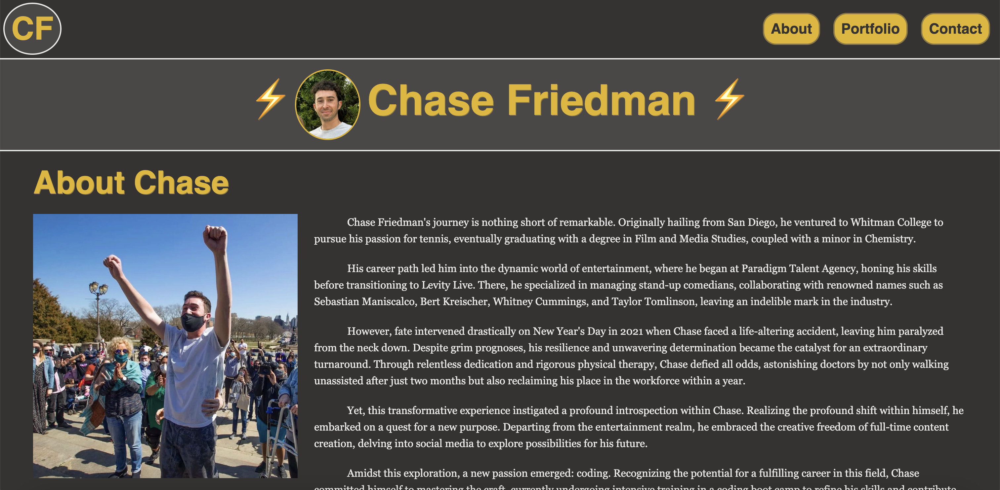

# Chase Friedman Portfolio

## Description

This is a working-in-progress website that displays all of Chase Friedmans launched websites and projects. As he deploys and updates new and existing projects, this website will update!

## Usage

Website can be reached at https://cfriedman2156.github.io/Personal-Portfolio/.

Use the navigation bar in the header to quickly access different sections, and click the gifs to be redirected to the deployed projects.

```md
    
    ```
## Credits

Gifs were found at https://giphy.com/, and social media icons come from https://fontawesome.com/.

## License

Refer to lisence in the repo.
